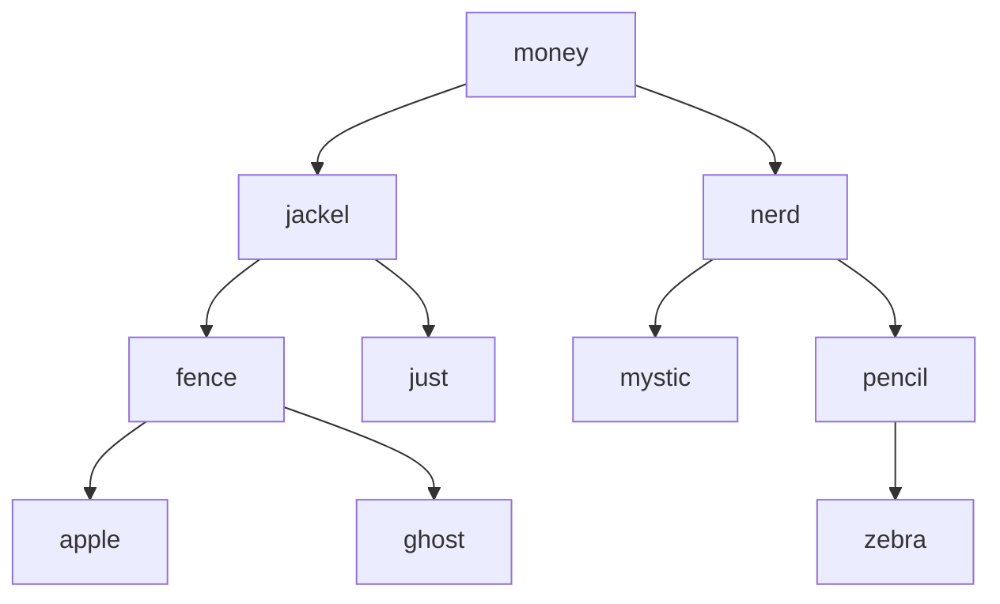

# Binary Search Trees -

### A List of Words

Imagine this list of words:

*apple, fence, ghost, jackal, just, money, mystic, nerd, pencil, zebra*

### Binary Search Tree



- Also a tree, made of nodes
- But each node has a left and right child
- Has a “rule” for arrangement
    - Often used for fast searching

## Implementing BSTs:

### Node Class
Node class is same as any other binary Node class:

```jsx
class BinarySearchNode {
  constructor(val, left=null, right=null) {
    this.val = val;
    this.left = left;
    this.right = right;
  }

  // other methods here
}
```

### Tree Class
Just like with n-ary trees, may not *always* need class for tree.

But it’s very useful for keeping track of root of tree:

```jsx
class BinarySearchTree {
  constructor(root) {
    this.root = root;
  }

  // other methods here
}
```
