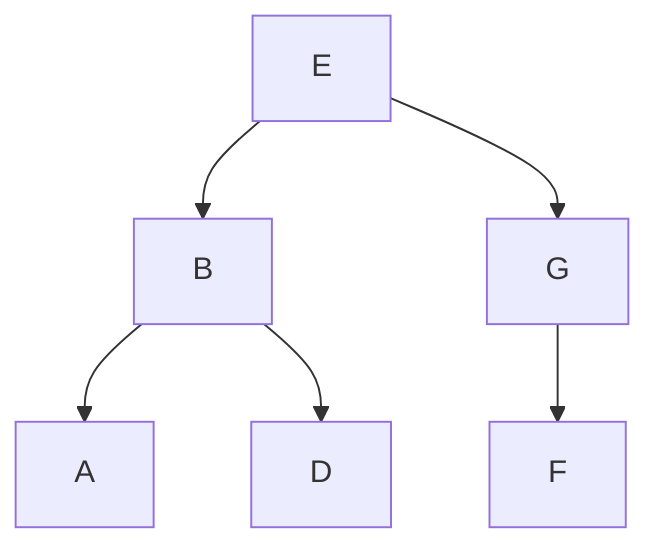
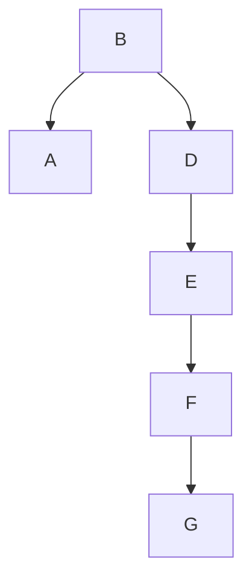

# Searching -

### Binary Search Tree Find



_demo/bst.js_
```jsx
find(sought) {
    let current = this;

    while (current) {
      if (current.val === sought) 
        return current;

      current = sought < current.val
                ? current.left
                : current.right;
    }
  }
```

Starting at ***E***, looking for ***C***:

1. ***C*** comes before ***E***, so go left to ***B***
2. ***C*** comes after ***B***, so go right to ***D***
3. ***C*** comes before ***D***, so go left to `None`
4. Drop out of `while` loop and return `None`

Every choice we make reduces # options by half!

For ***n*** nodes, we need to search, at most O(log n) nodes

We can search >1,000 nodes in only 10 steps!

We can search >1,000,000 nodes in only 20 steps!

## Balancing:

### **Valid But Badly Balanced**



- Can find ***A*** efficiently
- Can find missing ***C*** efficiently
- Can’t find ***G*** efficiently
- Tree needs to be “balanced”

### Balancing Trees
Easy ways to get reasonably balanced trees:

- shuffle values for tree randomly, and then insert
- or sort values, then insert from the middle working out

### Self-Balancing Trees
There are structure/algorithm pairs for BSTs that can balance themselves:

**AVL Trees**   Keeps balanced. Simpler algorithm but slightly less efficient.**Red/Black Trees** Keeps “reasonably” balanced. More complex algorithm but can be more efficient.

## Traversal:

Often, you don’t want to look at every node in a BST

That’s the point — you can search without looking at each!

But sometimes you will want to traverse entire tree

### In Order Traversal

```jsx
traverse(node) {
  if (node.left) traverse(node.left);
  console.log(node.val);
  if (node.right) traverse(node.right);
}
```


“traverse left, myself, traverse right” is “in-order”:

A → B → D → E → F → G

### Pre Order Traversal

```jsx
traverse(node) {
  console.log(node.val);
  if (node.left) traverse(node.left);
  if (node.right) traverse(node.right);
}
```


“myself, traverse left, traverse right” is “pre-order”:

E → B → A → D → G → F

### Post Order Traversal

```jsx
traverse(node) {
  if (node.left) traverse(node.left);
  if (node.right) traverse(node.right);
  console.log(node.val);
}
```


“traverse left, traverse right, myself” is “post-order”:

A → D → B → F → G → E
