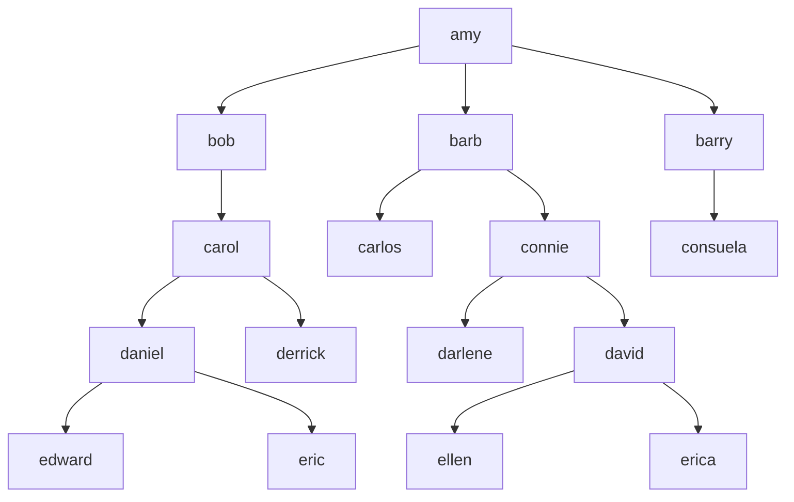
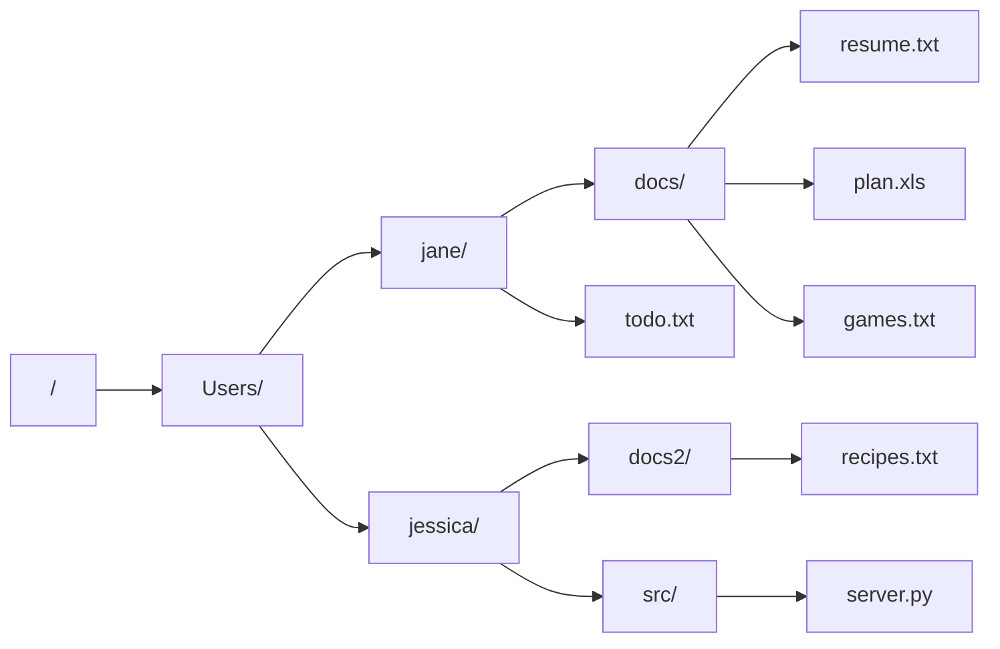

# Trees -

### Terminology
- **node**: basic unit
- **children**: nodes directly below a node
- **descendants**: nodes below a node
- **parent**: node that is directly above a node
- **ancestor**: node that is above a node
- **root node**: node at the top of tree
- **leaf node**: node without any children

### An Org Chart is a Tree

### A Filesystem is a Tree

### HTML DOM is a Tree

### A Taxonomy is a Tree

### This Is Not a Tree

- Trees need a root node — we don’t have one!
- A node can only have one parent

### Binary Trees/Binary Search Trees

These are different—and we’ll cover later!

General trees are sometimes called “n-ary” trees, since they can have *n* (any) number of children.
