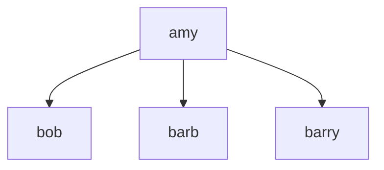

# Trees in JavaScript -

### Node Class

```jsx
class Node {
  constructor(val, children = []) {
    this.val = val;
    this.children = children;
  }
}
```

```jsx
let amy = new Node("amy");

amy.children.push(new Node("bob"));
amy.children.push(new Node("barb"));
amy.children.push(new Node("barry"));
```

```jsx
let amy = new Node("amy",
  [new Node("bob"),
   new Node("barb"),
   new Node("barry")])
```


### Finding a Node
Starting at Amy, find Connie:


_demo/trees.js_
```jsx
find(val) {
    let toVisitStack = [this];

    while (toVisitStack.length) {
      let current = toVisitStack.pop();

      if (current.val === val) 
        return current;

      for (let child of current.children) 
        toVisitStack.push(child)
    }
  }
```

“Depth First Search” (uses stack)


### Highest-Ranking Consuela
Say we hire another Consuela, a VP, & we want to find her


_demo/trees.js_
```jsx
findBFS(val) {
    let toVisitQueue = [this];

    while (toVisitQueue.length) {
      let current = toVisitQueue.shift();

      if (current.val === val) 
        return current;

      for (let child of current.children) 
        toVisitQueue.push(child)
    }
  }
```

“Breadth First Search” (uses queue)

### Tree Class

```jsx
class Tree {

  constructor(root) {
    this.root = root;
  }
}
```

```jsx
let org = new Tree(
  new Node("amy",
    [new Node("bob"),
     new Node("barb"),
     new Node("barry")]))
```



### Do You Really Need a Tree Class?
Each node is, itself, a tree!

It’s useful to have a Tree class, though, so you can keep track of the head node!

Can delegate to the head node for many operations:

```jsx
class Tree {
  constructor(root) {
    this.root = root;
  }

  /** findInTree: return node in tree w/this val */

  findInTree(val) {
    return this.root.find(val)
  }

  /** findInTreeBFS: return node in tree w/this val */

  findInTreeBFS(val) {
    return this.root.findBFS(val)
  }
}
```

### Also

Every linked list is a tree

But not every tree is a linked list.
