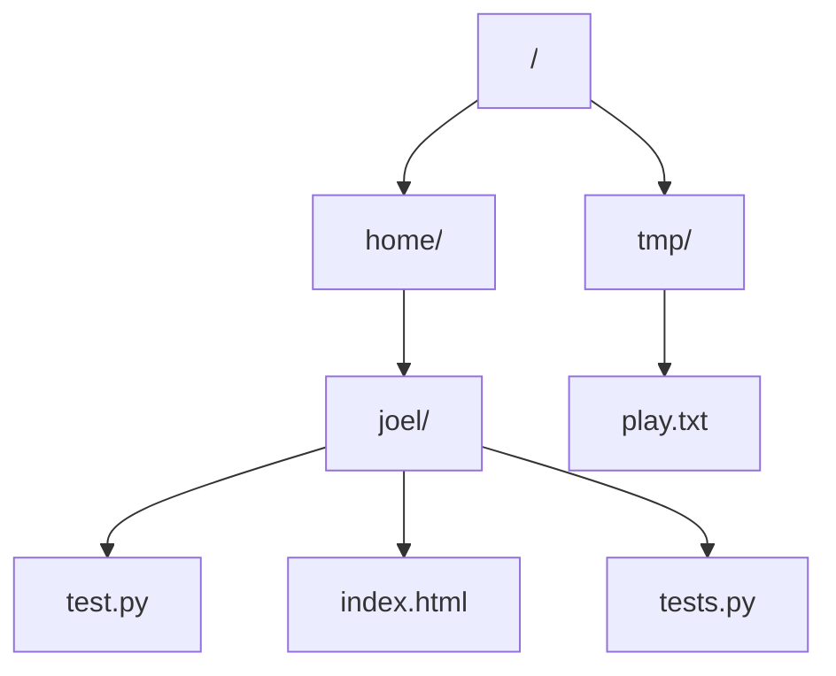

## **Recognizing Recursion**

### ****Filesystems****



### Fractals


### Parsing

`1 × ( 2 + 3 × ( 4 + 5 × 6 ) + 7 )`
This is a particularly good, hard exercise to give yourself.

### Nested Data
```js
<html>
  <head>
    <title>Title</title>
  </head>
  <body>
    <h1>Body</h1>
    <ul>
      <li>One</li>
      <li>Two
        <ul>
          <li>Two A</li>
          <li>Two B</li>
        </ul>
      </li>
    </ul>
  </body>
</html>
```

## Runtime:
What’s the runtime?
```js
function sum(nums) {
  if (nums.length === 0) return 0;

  return nums[0] + sum(nums.slice(1));
}
```

***O(n ^ 2)*** — we keep making new lists!
It also has ***O(n ^ 2)*** *runspace* — keeping all lists in memory!

### Improving Runtime
Often, you can keep track of position in array, rather than slice:
```js
function sum(nums, i=0) {
  if (i === nums.length) return 0;

  return nums[i] + sum(nums, i + 1);
}
```

Now runtime and runspace are ***O(n)***
****Accumulating Output****

_Given array of numbers, return even numbers_
```jsx
function evens(nums, i=0) {
  if (nums.length === i) return [];

  if (nums[i] % 2 === 0) {
    return [nums[i], ...evens(nums, i +1)];
  }

  return evens(nums, i + 1);
}
```

Back to ***O(n ^ 2)*** — making all those lists!

Can solve with “helper recursion”:
```js
function evens(nums) {
  let out = [];

  function _evens(nums, i) {
    if (nums.length === i) return;
    if (nums[i] % 2 === 0) out.push(nums[i]);
    _evens(nums, i + 1);
  }

  _evens(nums, 0);
  return out;
}
```

Back to ***O(n)***

### Accumulators
Often, can also solve with “accumulator”:
```js
function evens(nums, out=[], i=0) {
  if (nums.length === i) return out;

  if (nums[i] % 2 === 0) out.push(nums[i]);

  return evens(nums, out, i + 1);
}
```

Back to ***O(n)***
In some browsers, this can be “tail-call optimized”

## Resources:
[How Recursion Works](https://medium.freecodecamp.org/how-recursion-works-explained-with-flowcharts-and-a-video-de61f40cb7f9)
[Advanced: Tail Call Optimization](http://2ality.com/2015/06/tail-call-optimization.html)
