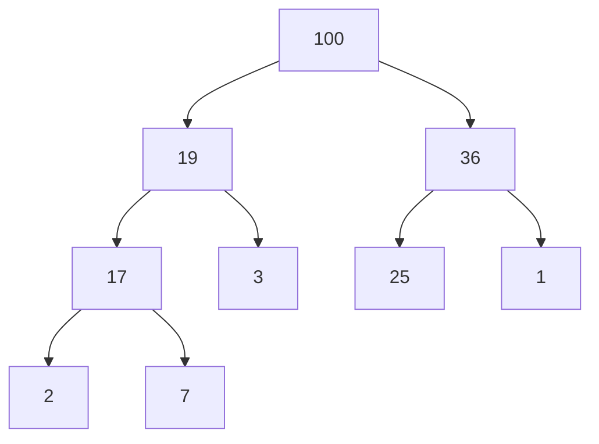

# Priority Queue

An *ADT* for a collection:
- Add item (with priority)
- Remove highest-priority item

### Typical Methods
- ***add(pri, item)***: Add item to queue
- ***poll()***: Remove & return top-priority item
- ***peek()***: Return (don’t remove) top-priority item
- ***isEmpty()***: Are there items in queue?

### Implementation
What’s a good implementation for priority queues?
- Arrays?
- Linked Lists?
- Doubly Linked List?

Consider with two strategies:
- Keep unsorted, add to end, find top priority on poll
- Keep sorted, add at right place, top priority is first

Keep unsorted, add to end, find top priority on poll:
- *Array*: **no**, peek & poll would be ***O(n)***
- *Linked List*: **no**, peek & poll would be ***O(n)***
- *Doubly Linked List*: **no**, peek & poll would be ***O(n)***

Keep sorted, add at right place, top priority is first:
- *Array*: **no**, add & poll would be ***O(n)***
- *Linked List*: **no**, add would be ***O(n)***
- *Doubly Linked List*: **no**, add would be ***O(n)***

### Heaps
Data structure optimized for priority queues: *heap*

### Resources
[Stacks and Overflows](https://medium.com/basecs/stacks-and-overflows-dbcf7854dc67)
[To Queue or Not To Queue](https://medium.com/basecs/to-queue-or-not-to-queue-2653bcde5b04)
[Learning to Love Heaps](https://medium.com/basecs/learning-to-love-heaps-cef2b273a238)
[Rithm School Lecture on Heaps](http://curric.rithmschool.com/r9/slides/dsa-pqueues/)
